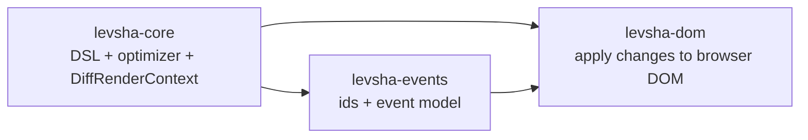
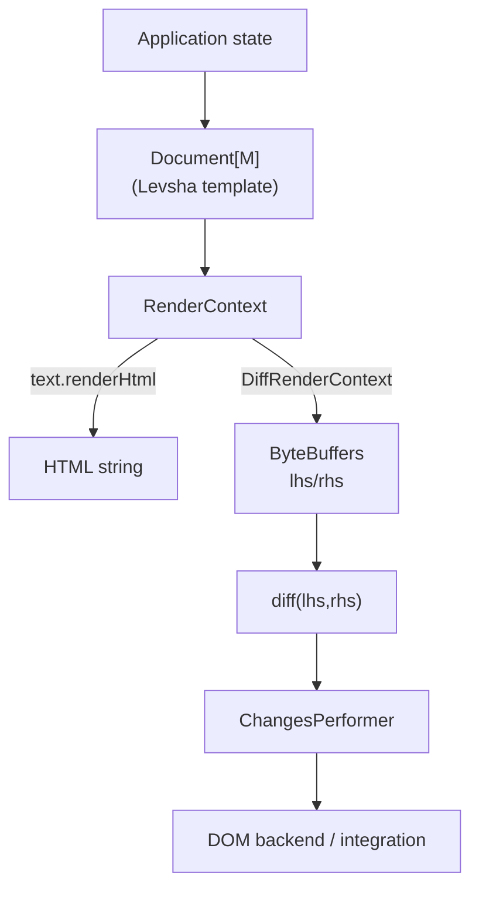
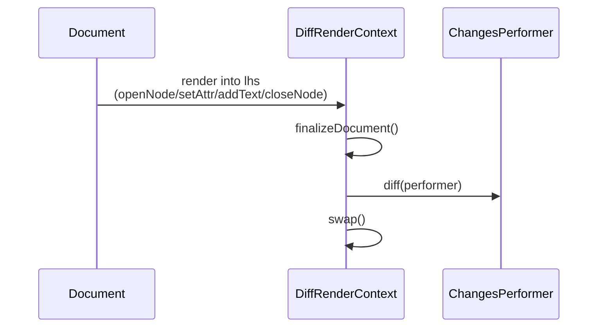

# Levsha

Levsha is a fast HTML template engine and eDSL for Scala 2.12, 2.13 and Scala 3. Optimized templates works without additional memory allocation. 
Levsha supports changeset inference, which allows to use it as virtual-dom-like middleware. 

## Static rendering

You can use Levsha as a static HTML renderer.

```scala
// build.sbt
libraryDependencies += "com.natural-transformation" %% "levsha-core" % "1.6.0"
```

```scala
// In your code
import levsha.text.renderHtml
import levsha.dsl._
import html._

val features = Seq("Very fast", "Memory-effective")

val html = renderHtml {
  optimize {
    body(
      div(
        clazz := "title",
        backgroundColor @= "red", 
        "Hello, I'm Levsha!"
      ),
      ul(clazz := "list",
        features map { feature =>
          li(class := "item", feature)
        }
      )
    )
  }
}

println(html)
```

```html
<body>
  <div style="background-color: red" class="title">Hello, I'm Levsha!</div>
  <ul class="list">
    <li class="item">Very fast</li>
    <li class="item">Memory-effective</li>
  </ul>
</body>
```

#### Benchmarks

Benchmarks show that Levsha is really fast. Unlike Twirl, 
Levsha's performance does not depend on template complexity.

| Test                  | Engine        | Ops/s        |
| --------------------- |:--------------| ------------:|
| simpleHtml            | levsha        | 1336693,499  |
| simpleHtml            | scalatags     |  533740,566  |
| simpleHtml            | twirl         | 5950436,854  |
| withConditionAndLoop  | levsha        | 1299646,768  |
| withConditionAndLoop  | scalatags     | 531345,430   |
| withConditionAndLoop  | twirl         | 239537,158   |
| withVariables         | levsha        | 1140298,804  |
| withVariables         | scalatags     | 483508,457   |
| withVariables         | twirl         | 2146419,329  |

In your sbt shell.

```
bench/jmh:run .StaticRenderingComparision
```

## As a virtual DOM

Levsha can be used as virtual-DOM-like middleware. Unlike other popular 
virtual DOM solutions, Levsha doesn't allocate additional memory for construction
of a new virtual DOM copy. Also it does not allocate memory in changes inferring phase.
Levsha's memory usage is constant.

```scala
// build.sbt
libraryDependencies += "com.natural-transformation" %%% "levsha-dom" % "1.6.0"
```

```scala
// In your code
import org.scalajs.dom._
import levsha.dom.render
import levsha.dom.event
import levsha.dsl._
import html._

case class Todo(id: String, text: String, done: Boolean)

def onSubmitClick() = {
  val input = document
    .getElementById("todo-input")
    .asInstanceOf[html.Input]
  val inputText = input.value
  // Reset input
  input.value = ""
  val newTodo = Todo(
    id = Random.alphanumeric.take(5).mkString,
    text = inputText,
    done = false
  )
  renderTodos(todos :+ newTodo)
}

def onTodoClick(todo: Todo) = {
  renderTodos(
    todos.updated(
      todos.indexOf(todo),
      todo.copy(done = !todo.done)
    )
  ) 
}

def renderTodos(todos: Seq[Todo]): Unit = render(document.body) {
  optimize {
    body(
      div(clazz := "title", "Todos"),
      ul(clazz := "list",
        todos map { todo =>
          li(
            todo match {
              case Todo(_, text, true) => strike(text)
              case Todo(_, text, false) => span(text)
            },
            event("click")(onTodoClick(todo))
          )
        }
      ),
      input(id := "todo-input", placeholder := "New ToDo"),
      button("Submit", event("click")(onSubmitClick()))
    )
  }
}

val todos = Seq(
  Todo("1", "Start use Levsha", done = false),
  Todo("2", "Lean back and have rest", done = false)
)

renderTodos(todos)
```

## Design

Levsha is a small core engine for building and diffing HTML-like trees in Scala. The key idea is: **a template is a function that writes rendering operations into a render context**. Depending on the render context implementation, those operations become either:

- an **HTML string** (static rendering), or
- a compact **byte-buffer encoded tree** that can be **diffed** to infer changes (virtual-DOM-like).

### Modules

- **`levsha-core`**: DSL + optimizer + render contexts (including `DiffRenderContext`)
- **`levsha-events`**: shared event/id model used by integrations
- **`levsha-dom`**: Scala.js DOM backend that applies diffs to the browser DOM



### The render pipeline

At runtime, a Levsha template is a `Document[M]` (usually created via the DSL as `Node[M]`, `Attr[M]`, `Style[M]`). Applying a document means calling methods on a `RenderContext`:

- `openNode(XmlNs, tag)`
- `setAttr(XmlNs, name, value)`
- `setStyle(name, value)`
- `addTextNode(text)`
- `closeNode(tag)`
- `addMisc(value)` (integration side-channel)



### `DiffRenderContext` lifecycle (and why `finalizeDocument()` matters)

`DiffRenderContext` keeps **two internal buffers**:

- **lhs**: the most recently rendered document (current)
- **rhs**: the previous document (baseline)

Diffing is a lifecycle. The important steps are:

1. **Render** by applying a `Document` to the render context (writes ops into **lhs**)
2. Call **`finalizeDocument()`** (flip lhs for reading + reset traversal state)
3. Call **`diff(performer)`** (read lhs/rhs and call the performer with inferred changes)
4. Call **`swap()`** to make the current buffer become the next baseline



**Design note:** `DiffRenderContext` is intentionally **stateful**. You typically keep one instance per render-loop (single-threaded) and reuse it across updates.

### `addMisc` as an integration hook

`addMisc(value)` attaches an out-of-band payload to the **current element id**. Integrations (eg frameworks built on Levsha) use it to collect things like:

- event handlers (keyed by element id + event type)
- element ids for imperative access
- component markers / other metadata

## Memory allocation model explanation

As noted below Levsha does not make _additional_
memory allocations if template optimized. It is
possible because optimized template, in compile-time
rewrites into calls of `RenderContext` methods
(unlike other template engines which represent 
their templates as AST on-heap).

For example,

```scala
optimize {
  div(clazz := "content", 
    h1("Hello world"),
    p("Lorem ipsum dolor")
  )
}
```

Will be rewritten to

```scala
Node { renderContext =>
  renderContext.openNode(XmlNs.html, "div")
  renderContext.setAttr(XmlNs.html, "class", "content")
  renderContext.openNode(XmlNs.html, "h1")
  renderContext.addTextNode("Hello world")
  renderContext.closeNode("h1")
  renderContext.openNode(XmlNs.html, "p")
  renderContext.addTextNode("Lorem ipsum dolor")
  renderContext.closeNode("p")
  renderContext.closeNode("div")
}
```

In turn, `RenderContext` (namely `DiffRenderContext` implementation)
saves instructions in `ByteBuffer` to infer changes in the future.

Of course, Levsha optimizer does not cover all cases.
When optimization can't be performed Levsha just 
applies current `RenderContext` to the unoptimized node.

```scala
optimize {
  ul(
    Seq(1, 2, 3, 4, 5, 6, 7).collect { 
      case x if x % 2 == 0 => li(x.toString)
    }
  )
}

// ==>

Node { renderContext =>
  renderContext.openNode(XmlNs.html, "ul")
  Seq(1, 2, 3, 4, 5, 6, 7)
    .collect {
      case x if x % 2 == 0 => 
        Node { renderContext =>
          renderContext.openNode(XmlNs.html, "li")
          renderContext.addTextNode(x.toString)
          renderContext.closeNode("li")
        }
    }
    .foreach { childNode =>
      childNode.apply(renderContext)
    }
  renderContext.closeNode("ul")
}
```

When you write your Levsha templates, keep in 
your mind this list of optimizations:

1. Nodes and attrs in branches of `if` expression will be moved to current `RenderContext`
2. Same for cases of pattern matching
3. `xs.map(x => div(x))` will be rewritten into a `while` loop
4. `maybeX.map(x => div(x))` will be rewritten into an `if` expression
5. `void` will be removed

The third item of this list shows us how to rewrite
previous example so that optimization could be performed.

```scala
optimize {
  ul(
    Seq(1, 2, 3, 4, 5, 6, 7)
      .filter(x => x % 2 == 0)
      .map { x => li(x.toString) }
  )
}

// ==>

Node { renderContext =>
  renderContext.openNode(XmlNs.html, "div")
  val iterator = Seq(1, 2, 3, 4, 5, 6, 7)
    .filter(x => x % 2 == 0)
    .iterator
  while (iterator.hasNext) {
    val x = iterator.next()
    renderContext.openNode(XmlNs.html, "li")
    renderContext.addTextNode(x.toString)
    renderContext.closeNode("li")
  }
  renderContext.closeNode("div")
}
```

## Optimizer options

You can pass this options to SBT.

```bash
$ sbt -Doption=value
```

Option | Description | Possible values | Default
--- | --- | --- | ---
`levsha.optimizer.logUnableToOptimize` | Write positions of unoptimized parts of code to a file. | true/false or file name | false
`levsha.optimizer.unableToSort.forceOptimization` | If tag node content couldn't be sorted in compile time, optimizer will keep the code unoptimized (so content will be sorted in runtime). You can force optimizer to ignore unspecified Documents (that couldn't be sorted) and optimize anyway, but keep in mind that node content should be ordered (styles, attrs, nodes). | true/false | false
`levsha.optimizer.unableToSort.warnings` | Warns that optimizer can't sort tag content when optimization is forced. | true/false | true
 

## Worthy to note

1. [The Tale of Cross-eyed Lefty from Tula and the Steel Flea](https://en.wikipedia.org/wiki/The_Tale_of_Cross-eyed_Lefty_from_Tula_and_the_Steel_Flea)
